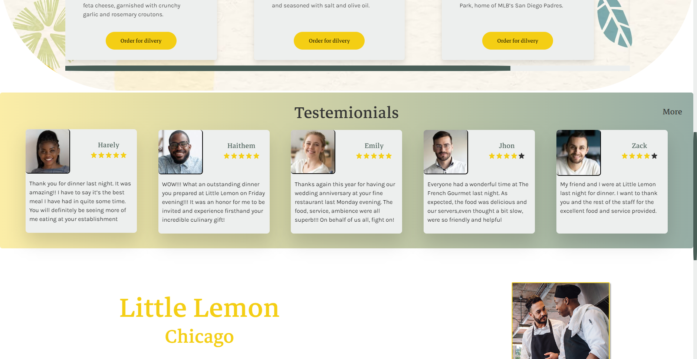

# Little Lemon website

This is a concept website for a resturant named Little Lemon, which included the home page of the site + the reserving a table page

## Table of contents

- [Task](#task)
  - [Screenshot](#screenshot)
- [Author](#author)

## Task

### The challenge

- Build out the project to the designs provided
- Making sure it's fully responsive and works for all screen widths
- Making sure the reserve a table page and forms inside it comply to Ux/Ui design prenciples

### Screenshot

## Author

- Kristiyan Velkov
